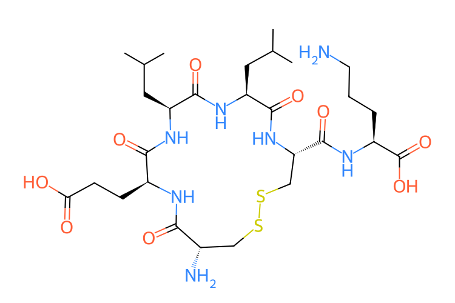

# Cyclic Peptide Modification Generator (`cpmgen`)

##  NOTE  
**The code base is under NDA with my previous employer.  
This README is shared with permission solely to illustrate design
decisions and scope.**

## Applications
- Exploring cyclic peptide sequence and conformational space.
- Generating input for docking workflows.
- Genreating input for ML training (coupled with the [CREST](https://pubs.aip.org/aip/jcp/article/160/11/114110/3278084) method for conformational search).

Actual README of the code starts below.
---
<div align="center">
    
</div>

The `cpmgen` tool facilitates the generation of modified cyclic peptide structures from input SMILES strings, sequences, or HELM codes. It leverages RDKit and functions adapted from CycloPs to enrich the chemical diversity of cyclic peptides through strategic modifications, including cyclization patterns, mutations, and the inclusion of D-amino acids (dAAs) and non-canonical amino acids (ncAAs).

---

## Features

- **Input Flexibility**: Accepts peptide structures in three formats:
  - **SMILES**: Converts to sequences and generates mutations or modifications.
  - **SEQUENCE**: Supports linear sequences and custom cyclization patterns.
  - **HELM**: Directly parses HELM notation for sequence and cyclization data.
- **Cyclization Patterns**: Generates peptides with various cyclization types, including:
  - **Head-to-tail** (HT)
  - **Disulfide bonds** (SS)
  - **Side-chain to backbone** (SCCT, SCNT)
  - **Side-chain to side-chain** (SCSC)
- **Stability and Synthetic Feasibility**: Filters modifications based on chemical stability and synthesis rules.
- **Library Generation**: Produces libraries of modified cyclic or linear peptides with configurable mutation ratios, ncAA and dAA content, and library size limits.
- **Peptide Analysis**: Offers a tool to analyze peptide SMILES and sequences to determine structural features and amino acid composition.
- **Peptide Similarity**: Align two sequences (can be cyclic!), search best submatch and compute similarity.
---

## Installation

To install `cpmgen`, you can use pip. Before installation, clone the repository.

### Cloning the Repository 

```bash
git clone https://github.com/JonathanSemelak/cpmgen.git
```

### Installing

For development purposes, install the package in editable mode:

```bash
cd cpmgen
pip install -e .
```

For standard use, omit the `-e` flag.

---

## Usage

### As a Command-Line Tool

After installation, use `cpmgen` directly from the command line to generate modified cyclic peptides. Run the following command with the necessary options:

```bash
cpmgen --input INPUT --output OUTPUT_NAME [OPTIONS]
```

**Available Options:**
- **Input Options**:
  - `--input` (`-i`): Specify the input (SMILES string, sequence, or HELM code).
  - `--mode` (`-m`): Specify the input format (`SMILES`, `SEQUENCE`, or `HELM`) (default: `SMILES`).
  - `--cyclic`: Indicate if the input peptide is cyclic.
  - `--cyclization_pattern`: Cyclization pattern for sequences (e.g., `HT`, `SS`, `SCCT`, `SCNT`, `SCSC`). Ignored in `HELM` mode.
- **Mutation Options**:
  - `--max_mutation_ratio`: Set the maximum mutation ratio (default: `0.2`).
  - `--max_daa_content`: Set the maximum D-amino acid content (default: `0`).
  - `--max_ncaa_content`: Set the maximum non-canonical amino acid content (default: `0.2`).
- **Output Options**:
  - `--max_library_size`: Define the maximum number of peptides in the output library (default: unlimited).
  - `--only_smiles`: Output only the SMILES strings.
  - `--only_helm`: Output only the HELM strings.
  - `--exclude_linears`: Exclude linear peptides from the output.
- **Filtering**:
  - `--filter_by_synth_rules`: Apply synthesis feasibility rules for filtering. #Needs fixing

---

### As a Library

For programmatic use, import and use the `generate_peptides` function within your Python scripts:

```python
from cpmgen import generate_peptides

# Example usage
generate_peptides(
    input="N[C@@]([H])(C)C(=O)N[C@@]([H])(C)C(=O)N[C@@]([H])(C)C(=O)O",  # Example SMILES for AAA
    output_name="output_filename",
    mode="SMILES",
    cyclic=False,
    max_mutation_ratio=0.1,
    max_daa_content=0.2,
    max_ncaa_content=0.2,
    max_library_size=0,
    only_smiles=True,
    only_helm=False,
    exclude_linears=True,
    filter_by_synth_rules=True
)
```

This function generates a library of modified peptides based on the provided parameters and saves them to the specified output file.

## Analyzing Existing Peptides
`cpmgen` provides a peptide analyzer mode to inspect input SMILES (and optionally a sequence) to identify cyclization patterns, ncAA content, and other features.

Analyzer Options:

    --smiles_analyzer: Run in analysis mode instead of generating peptides.
    
    --seq_to_analyze: Provide a sequence for analysis. If not provided, cpmgen attempts to deduce one from the SMILES.

### As a Command-Line Tool

```bash
cpmgen --input "N[C@@H](C)C(=O)N[C@@H](C)C(=O)N[C@@H](C)C(=O)O" \
       --smiles_analyzer \
       --seq_to_analyze "Ala, Ala, Ala, Ala"
```

### As a Library

For programmatic use, import and use the `analyze_peptide` function within your Python scripts:

```python
from cpmgen import analyze_peptide

# Example usage
analyze_peptide(input_smiles="N2[C@@]([H])(Cc1ccc(O)cc1)C(=O)N[C@@]([H])(C(C)C)C(=O)N[C@@]([H])(C)C(=O)N[C@@]([H])(CC(=O)O)C2(=O)",
                input_seq=['Tyr', 'Val', 'Ala', 'Asp'])
```
---
## Aligning Two Sequences And Report Similarity
`cpmgen` provides a tool to align two sequences and report the similarity between them calculated as the lengh of the best submatch vs the largest of the two sequences.

Analyzer Options:

    --seqs_alignment: Run in analignment mode.
    
    --seq_to_align_A: Provide a sequence for analysis.
    
    --seq_to_align_B: Provide another sequence for analysis.

    --cyclic: If specified, rotamers of the sequences will be considered for alignment (Note it does not discriminate between cyclization types).

### As a Command-Line Tool

```bash
cpmgen --seqs_alignment -sA "Met,Gly,Gly,Lys,Gly,Val" -sB "Gly,Gly,Lys,Gly" --cyclic
```

### As a Library

For programmatic use, import and use the `seqs_alignment` function within your Python scripts:

```python
from cpmgen import seqs_alignment

# Example usage
seqs_alignment(input_seq_A=["Phe", "Val", "Ala", "Gly"], input_seq_B=["Ala", "Gly", "Phe", "Val"], cyclic=True)
```
---

## Notable Changes

- **HELM Input Support**: HELM codes are now directly parsed, extracting sequences and cyclization patterns without manual specification.
- **Cyclization Validation**: The tool validates sequences and cyclization patterns for correctness when provided separately (e.g., in SEQUENCE mode).
- **Expanded Output Control**: You can now specify output format preferences with `--only_smiles` or `--only_helm`.
- **Extended ncAAs Library**: About 100 monomers from the [CycPeptMPDB monomers library](http://cycpeptmpdb.com/monomers) are now supported.
- **Peptide Analyzer**: New analyze_peptide function and --smiles_analyzer CLI option for detailed peptide inspection.
- **Sequence Alignment**: New analyze_peptide function and --smiles_analyzer CLI option for detailed peptide inspection.
---

## Coming Soon

### Feature Enhancements

- **Advanced Post-Processing**: Enhanced filtering options based on biological activity, in vivo stability, or docking results.

### Algorithm Improvements

- **Random Sampling**: Implementing efficient sampling to handle combinatorial explosion in sequence space exploration.
- **Cyclization Prioritization**: Introducing rules to refine cyclization pattern preferences based on specific structural or functional properties.

### Input/Output Improvements

- **More Input Formats**: Support for input via JSON, enabling compatibility with popular datasets.
- **Visualization Tools**: Generating structural visualizations for the generated peptide library.

---
